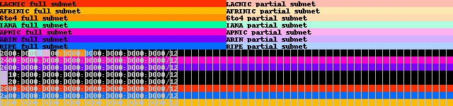

# ipviz
Script to visualize blocks of IP addresses, both as text and as an image.

Works for IPv4 and IPv6.

Built for Python3, works fine for Python2 as well.

## Usage
Given a file containing a list of IP addresses and optional labels, such as this:

```
2001:0000::/23  IANA
2001:0200::/23  APNIC
2001:0400::/23  ARIN
2001:0600::/23  RIPE NCC
2001:0800::/23  RIPE NCC
2001:0a00::/23  RIPE NCC
2001:0c00::/23  APNIC
2001:0e00::/23  APNIC
2001:1200::/23  LACNIC
2001:1400::/23  RIPE NCC
2001:1600::/23  RIPE NCC
2001:1800::/23  ARIN
2001:1a00::/23  RIPE NCC
2001:1c00::/22  RIPE NCC
2001:2000::/20  RIPE NCC
2001:3000::/21  RIPE NCC
2001:3800::/22  RIPE NCC
2001:3c00::/22  IANA
2001:4000::/23  RIPE NCC
2001:4200::/23  AFRINIC
2001:4400::/23  APNIC
2001:4600::/23  RIPE NCC
2001:4800::/23  ARIN
2001:4a00::/23  RIPE NCC
2001:4c00::/23  RIPE NCC
2001:5000::/20  RIPE NCC
2001:8000::/19  APNIC
2001:a000::/20  APNIC
2001:b000::/20  APNIC
2002:0000::/16  6to4
2003:0000::/18  RIPE NCC
2400:0000::/12  APNIC
2600:0000::/12  ARIN
2610:0000::/23  ARIN
2620:0000::/23  ARIN
2800:0000::/12  LACNIC
2a00:0000::/12  RIPE NCC
2c00:0000::/12  AFRINIC
```

This command:
```
ipviz.py IPv6ranges.txt --image -b10 -s18
```

will produce a text output like this:

```
These are all the networks to visualise:
['2001:0000:0000:0000:0000:0000:0000:0000/23', '2001:0200:0000:0000:0000:0000:0000:0000/23', '2001:0400:0000:0000:0000:0000:0000:0000/23', '2001:0600:0000:0000:0000:0000:0000:0000/23', '2001:0800:0000:0000:0000:0000:0000:0000/23', '2001:0a00:0000:0000:0000:0000:0000:0000/23', '2001:0c00:0000:0000:0000:0000:0000:0000/23', '2001:0e00:0000:0000:0000:0000:0000:0000/23', '2001:1200:0000:0000:0000:0000:0000:0000/23', '2001:1400:0000:0000:0000:0000:0000:0000/23', '2001:1600:0000:0000:0000:0000:0000:0000/23', '2001:1800:0000:0000:0000:0000:0000:0000/23', '2001:1a00:0000:0000:0000:0000:0000:0000/23', '2001:1c00:0000:0000:0000:0000:0000:0000/22', '2001:2000:0000:0000:0000:0000:0000:0000/20', '2001:3000:0000:0000:0000:0000:0000:0000/21', '2001:3800:0000:0000:0000:0000:0000:0000/22', '2001:3c00:0000:0000:0000:0000:0000:0000/22', '2001:4000:0000:0000:0000:0000:0000:0000/23', '2001:4200:0000:0000:0000:0000:0000:0000/23', '2001:4400:0000:0000:0000:0000:0000:0000/23', '2001:4600:0000:0000:0000:0000:0000:0000/23', '2001:4800:0000:0000:0000:0000:0000:0000/23', '2001:4a00:0000:0000:0000:0000:0000:0000/23', '2001:4c00:0000:0000:0000:0000:0000:0000/23', '2001:5000:0000:0000:0000:0000:0000:0000/20', '2001:8000:0000:0000:0000:0000:0000:0000/19', '2001:a000:0000:0000:0000:0000:0000:0000/20', '2001:b000:0000:0000:0000:0000:0000:0000/20', '2002:0000:0000:0000:0000:0000:0000:0000/16', '2003:0000:0000:0000:0000:0000:0000:0000/18', '2400:0000:0000:0000:0000:0000:0000:0000/12', '2600:0000:0000:0000:0000:0000:0000:0000/12', '2610:0000:0000:0000:0000:0000:0000:0000/23', '2620:0000:0000:0000:0000:0000:0000:0000/23', '2800:0000:0000:0000:0000:0000:0000:0000/12', '2a00:0000:0000:0000:0000:0000:0000:0000/12', '2c00:0000:0000:0000:0000:0000:0000:0000/12']

Each row is a /12 and each point represents a /18 subnet
. = no network, lowercase = partial subnet, uppercase = full subnet

2000::/12
....ira.6666R...................................................
2400::/12
AAAAAAAAAAAAAAAAAAAAAAAAAAAAAAAAAAAAAAAAAAAAAAAAAAAAAAAAAAAAAAAA
2600::/12
AAAAAAAAAAAAAAAAAAAAAAAAAAAAAAAAAAAAAAAAAAAAAAAAAAAAAAAAAAAAAAAA
2610::/12
a...............................................................
2620::/12
a...............................................................
2800::/12
LLLLLLLLLLLLLLLLLLLLLLLLLLLLLLLLLLLLLLLLLLLLLLLLLLLLLLLLLLLLLLLL
2a00::/12
RRRRRRRRRRRRRRRRRRRRRRRRRRRRRRRRRRRRRRRRRRRRRRRRRRRRRRRRRRRRRRRR
2c00::/12
AAAAAAAAAAAAAAAAAAAAAAAAAAAAAAAAAAAAAAAAAAAAAAAAAAAAAAAAAAAAAAAA
```

And an image output like this:



## Installation
Just the one file (ipviz.py) required. Has dependencies on the following libraries:
* [Pillow](http://pillow.readthedocs.org/en/latest/index.html), available for Python2 and Python3
* ipaddress (standard for Python3, or [py2-ipaddress](https://pypi.python.org/pypi/py2-ipaddress/2.0) backport for Python2
* argparse, random, and colorsys should be standard

## Known bugs/limitations
* If the subnet size for output is larger than some of the networks to display, only the first network will be listed
